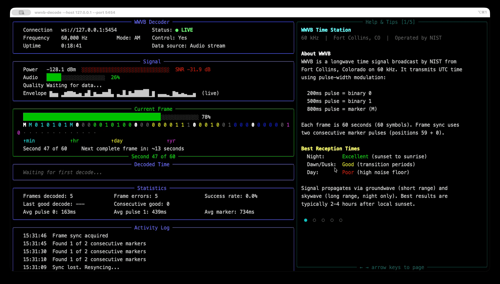

# WWVB Decoder

A real-time WWVB 60 kHz time signal decoder that connects to [SDRConnect](https://www.sdrplay.com/sdrconnect/) via its WebSocket API. Receives the NIST time broadcast from Fort Collins, CO using an SDRplay RSP receiver, decodes pulse-width modulated BCD time data, and displays results in a live terminal UI.



## How It Works

WWVB transmits UTC time on 60 kHz using pulse-width modulation:

| Pulse Width | Symbol | Meaning |
|-------------|--------|---------|
| 200ms | `0` | Binary zero |
| 500ms | `1` | Binary one |
| 800ms | `M` | Marker / frame sync |

Each frame is 60 symbols (one per second). The decoder extracts the amplitude envelope from demodulated audio, classifies pulse widths into symbols, assembles complete frames, and parses BCD-encoded time fields (minutes, hours, day-of-year, year, leap second, DST).

## Features

- Connects to SDRConnect over WebSocket and auto-tunes to 60 kHz AM
- Real-time envelope detection with Butterworth LPF and adaptive normalization
- Hysteresis-based pulse classification for noise resilience
- Multi-frame confirmation before reporting decoded time
- Two-tier overload detection (SDR hardware ADC vs. audio-level clipping)
- Rich terminal UI with live envelope trace, signal metrics, and activity log
- Paginated tips/help panel with arrow key navigation
- Plain text mode for headless or logging use
- Responsive layout (tips panel hides on narrow terminals)

## Prerequisites

- **SDRConnect** running with WebSocket API enabled (default port 5454)
- **SDRplay RSP hardware** (RSPdx recommended for VLF with Hi-Z input)
- **VLF antenna** - long wire, loop tuned to 60 kHz, or whip
- **Python 3.10+**

## Installation

```bash
git clone https://github.com/eusef/wwvb-decoder.git
cd wwvb-decoder
pip install -e .
```

## Usage

Start SDRConnect first, then run the decoder:

```bash
wwvb-decode
```

The decoder will connect to SDRConnect, tune to 60 kHz AM, and begin listening for WWVB pulses.

### CLI Options

| Flag | Default | Description |
|------|---------|-------------|
| `--host` | `127.0.0.1` | SDRConnect WebSocket host |
| `--port` | `5454` | SDRConnect WebSocket port |
| `--antenna` | `Hi-Z` | Antenna port selection |
| `--if-gain N` | auto | IF gain reduction (0-59 dB for RSPdx, lower = more gain) |
| `--rf-gain N` | auto | LNA state / RF gain (0-9 for RSPdx, higher = more gain) |
| `--threshold` | `0.5` | Envelope threshold for pulse detection (0.0-1.0) |
| `--min-frames` | `2` | Consecutive matching frames needed before confirming time |
| `--no-tune` | off | Skip radio configuration (use if already tuned) |
| `--plain` | off | Plain text output instead of TUI |
| `--debug` | off | Verbose logging (implies --plain) |

### Examples

```bash
# Connect to SDRConnect on a remote machine
wwvb-decode --host 192.168.1.50

# Manual gain control
wwvb-decode --if-gain 0 --rf-gain 7

# Headless / logging mode
wwvb-decode --plain

# Already tuned in SDRConnect, just decode
wwvb-decode --no-tune
```

## TUI Controls

| Key | Action |
|-----|--------|
| Left/Right arrows | Navigate tips pages |
| `q` | Quit |
| `Ctrl+C` | Quit |

## Reception Tips

WWVB signal strength varies dramatically by time of day:

| Time | Quality | Notes |
|------|---------|-------|
| Night (sunset to sunrise) | Excellent | Skywave propagation, best 2-4 hours after sunset |
| Dawn/Dusk | Good | Transition periods |
| Daytime | Poor | High noise floor, groundwave only |

For best results:
- Use Antenna Port A (Hi-Z) on the RSPdx
- Orient loop antennas broadside toward Fort Collins, CO
- Set IF gain to 0, then increase RF gain until just below ADC overload
- Disable AGC in SDRConnect (the decoder does this automatically)
- Use a narrow bandwidth (100 Hz, set automatically)

## Architecture

```
SDRConnect (WebSocket)
    |
    v
SDRConnectClient --- JSON property get/set + binary audio stream
    |
    v
EnvelopeDetector --- Butterworth LPF, decimation, normalization
    |
    v
PulseDecoder --- Hysteresis thresholding, pulse width classification
    |
    v
FrameAssembler --- Marker sync, BCD parsing, multi-frame confirmation
    |
    v
TUIDisplay / PlainDisplay --- Rich Live terminal or plain text output
```

## Development

```bash
# Install dev dependencies
pip install -e ".[dev]" 2>/dev/null || pip install -e .

# Run tests
pytest tests/ -v
```

## Links

- [NIST WWVB Info](https://www.nist.gov/pml/time-and-frequency-division/time-services/wwvb-60-khz)
- [SDRConnect](https://www.sdrplay.com/sdrconnect/)
- [SDRplay RSPdx](https://www.sdrplay.com/rspdx/)

## License

MIT
